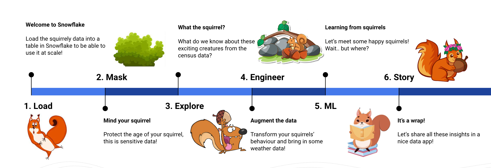

## :heart: Squirrelly Hands-on-Lab with Snowpark Python  


Have you ever wondered how many squirrels are in NYC parks, where they are located, and what they are up to? Do you like people-watching, storytelling, music, fortunes, meditation, squirrel jokes, making fun of dogs, food reviews of data, squirrels teaming up to fight a hungry hawk, and the phrase “forever wild”?

Then this is the perfect hands-on workshop for you! 

   


### :checkered_flag: Requirements:  
- Create a [Snowflake Trial Account](https://signup.snowflake.com/)  
    - Edition: **Enterprise**
    - Cloud Provider: **AWS** <- Must be AWS for this HOL
    - Region: **Frankfurt**.  
    Note down the account identifier and region to be used in the hands-on-lab.  The account identifier and region can be found in the confirmation email from Snowflake Trial setup.  Alternatively, the account identifier can be found in the URL of the Snowflake console when logged-in.  (Example account: xxNNNNN, region: eu-central-1.  
- A [DeepNote](https://deepnote.com/) account. 
  
### :bulb: Example Use-Case
In this example we use the [Central Park Squirrel Census dataset](https://data.cityofnewyork.us/Environment/2018-Central-Park-Squirrel-Census-Squirrel-Data/vfnx-vebw). The [Squirrel Census](https://www.thesquirrelcensus.com/) is a multimedia science, design, and storytelling project focusing on the Eastern gray (Sciurus carolinensis). They count squirrels and present their findings to the public. This table contains squirrel data for each of the 3,023 sightings, including location coordinates, age, primary and secondary fur color, elevation, activities, communications, and interactions between squirrels and with humans.

### :books: Storyline:

- Do you wake up in the middle of the night thinking how many squirrels are out there? Or how they can predict a bad winter? 
- During this workshop you will learn to quickly get “nutty” insights out of your data by:
    -   Bringing all the data together
    -   Data governance: privacy for all the squirrels (Masking their age)
    -   Data sharing: access to Weather data (Marketplace)
    -   Data engineering (Snowpark)
    -   Data science (Clustering for happy squirrels using Snowpark and SProc)
    -   Data storytelling (Streamlit)

  
  
### :tada: Setup Steps:

- Login to your [Snowflake Trial account](https://app.snowflake.com/) with the admin credentials that were created with the account in one browser tab (a role with ORGADMIN privileges). Keep this tab open during the hands-on-lab.  
    - Click on the Billing on the left side panel. 
    - Click on [Terms and Billing](https://app.snowflake.com/terms-and-billing).
    - Enable Anaconda Python Packages to continue with the hands-on-lab.
- Login to [DeepNote](https://deepnote.com/) in another browser tab.  
    - Create a workspace 
    - Create a New Project 
    - Go back and then click on the "+" to add a new terminal 
    - Copy paste these 2 commands into the terminal: 
          ```git clone https://github.com/sfc-gh-tpetrache/developer_day_snowpark.git```
          and then
          ```cp developer_day_snowpark/requirements.txt . ```
    - Go to Environment and choose Python 3.8 
    - Check Allow incoming connections (will use that for Streamlit). This option will open a tunneling link that we will use to open our Streamlit app

### :fire: Extra
For more specific instructions, follow this [link](https://docs.google.com/document/d/1AmpHXbjNHg-JabYCe4iuPwcBszA3lWfQymyhFLIcC58/edit?usp=sharing)!